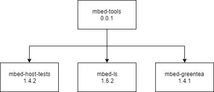

# Unified Mbed Tools

`mbed-tools` will be the name of the unified tools repo. It will also be the name of the unified tools pip package.
From this codebase, we will still be releasing the other pip packages that we currently maintain in separate repos.
For the initial release of `mbed-tools`, this will include:

- `mbed-ls` (Mbed LS): https://github.com/ARMmbed/mbed-ls
- `mbed-host-tests` (htrun): https://github.com/ARMmbed/htrun
- `mbed-greentea` (greentea): https://github.com/ARMmbed/greentea

From the user's perspective, nothing will change if they upgrade their version of the above packages.
They will still receive the correct packages and all the existing command line tools.
The only thing that will change on their system is an additional package will be installed. This is the `mbed-tools` package.


## Package and API structure

```
mbed_lstools            mbed_host_tests         mbed_greentea
 +---------+          +-----------------+     +---------------+
 |         |          |                 |     |               |
 | mbed-ls |          | mbed-host-tests |     | mbed-greentea |
 |         |          |                 |     |               |
 +----+----+          +--------+--------+     +-------+-------+
      ^                        ^                      ^
      |              mbed_tools.test |                      |
      |                        |                      |
      |                  +-----+------+               |
      |   mbed_tools.detect    |            |   mbed_tools.test   |
      +------------------+ mbed-tools +---------------+
                         |            |
                         +------------+
```

_The above diagram shows the released packages in boxes. The exposed modules are shown next to the packages._

`mbed-tools` will expose the following modules:

- `mbed_tools.detect` - All code contained within Mbed LS, used for detecting attached platforms
- `mbed_tools.test` - All code used to test platforms with the "greentea" framework
 - Will also need to plan ahead for icetea integration here

The other packages will then be in charge of taking these modules and exposing the existing public API. (ex. `import mbed_lstools` for mbed-ls)
The goal will be in the future to remove the other bespoke packages and just consolidate on the `mbed_tools.*` API exposed by `mbed-tools`.
This path gives us the opportunity to deprecate the other packages to allow users to migrate.

## Versioning

The versions of the legacy released packages (initially `mbed-ls`, `mbed-host-tests`, and `mbed-greentea`) will continue unaffected.
`mbed-tools` will be released initially as `0.x` indicating that the APIs are unstable. This will give us time to evolve the API and build up our
processes. We don't intend to make API changes that often, but it may be necessary to do so in the first few releases.

When it comes time to drop the legacy packages, `mbed-tools` will be released as stable (`1.0`). Before being released as stable, the following tasks should
be completed:

- All legacy packages are marked as deprecated with a redirect to `mbed-tools`
  - The Python modules should also print deprecation messages when using the legacy modules directly
- Any relevant issues on each of the legacy projects' GitHub pages are filed against `mbed-tools`
- All documentation for `mbed-tools` needs to be delivered to the Mbed OS docs team for deployment to `os.mbed.com/docs`

## Releasing



The packages need to be released in the correct order. This is due to the new dependencies described above. Follow these steps to make a new release of the tools:

1. Release mbed-tools with a patch version increase
2. For each legacy package, change the "mbed-tools" requirement version to the number just released (in this case it would be 0.0.1).
3. For each legacy package, increase each patch number (this will vary with each package). 
4. Release each legacy package to pypi

## Documentation

All public APIs are required to be fully documented with comments throughout the codebase. From these comments,
we will generate API documentation. There will also be examples and in-depth descriptions for higher-level concepts.
This documentation is strictly for the `mbed-tools` package, **NOT the other legacy packages**. The legacy packages will
retain their current documentation (typically just a README in the project folder).

The documentation will be versioned with each release of `mbed-tools`. We plan to evolve the automated processes to generate
these documents as the repository matures. We plan to use GitHub Pages as a the main reference site while `mbed-tools` is in versions 0.x (unstable), but also as a staging site for our automated deliverables. When the package is released as 1.0 (stable), these generated documents will be delivered to the docs team for hosting on os.mbed.com/docs.
